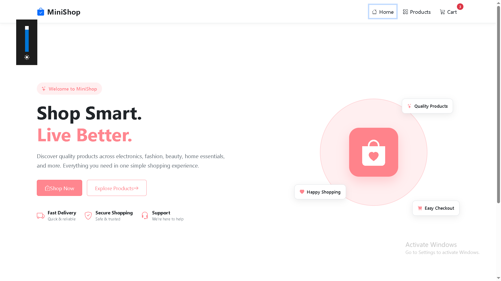
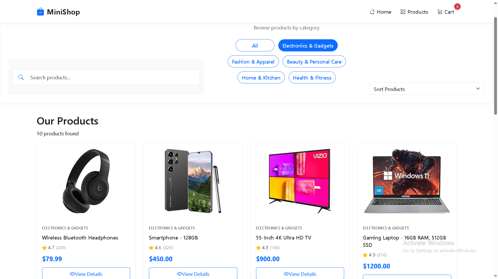

# 🛒 Mini E-Commerce Website

A responsive and user-friendly **Mini E-Commerce Website** built with React and modern web technologies. This project demonstrates product listing, API integration, dynamic UI rendering, and responsive design for an online shopping experience.

## 🌐 Live Demo

🚀 **Live Website:**
https://mini-e-commercewebsite.netlify.app/

📦 **GitHub Repository:**
https://github.com/MeharYG-dev/Mini-E-Commerce-Website

---

## 📸 Project Screenshots

### 🏠 Home Page



### 🛍️ Products Page



---

## ✨ Features

* 🛍️ Dynamic product listing
* 🔎 Product search functionality
* 📦 Product details
* 🛒 Shopping cart functionality
* 🔄 API integration for product data
* 📱 Fully responsive design
* 🎨 Clean and modern user interface
* ⚡ Fast development and build using Vite
* 🧩 Reusable React components
* 🌐 Deployed on Netlify

---

## 🛠️ Technologies Used

* **HTML5** – Page structure
* **CSS3** – Styling and responsive design
* **JavaScript (ES6+)** – Application logic
* **React.js** – Component-based UI development
* **Vite** – Development server and build tool
* **Bootstrap / React Bootstrap** – Responsive UI components
* **REST API** – Dynamic product data
* **Git & GitHub** – Version control
* **Netlify** – Deployment

---

## 📂 Project Structure

```text
Mini-E-Commerce-Website/
│
├── public/
│
├── src/
│   ├── Home.png
│   ├── Products.png
│   │
│   ├── components/
│   │   ├── Navbar.jsx
│   │   ├── ProductList.jsx
│   │   └── ...
│   │
│   ├── App.jsx
│   ├── App.css
│   └── main.jsx
│
├── .gitignore
├── package.json
├── README.md
└── vite.config.js
```

---

## ⚙️ Installation and Setup

### 1. Clone the repository

```bash
git clone https://github.com/MeharYG-dev/Mini-E-Commerce-Website.git
```

### 2. Navigate to the project folder

```bash
cd Mini-E-Commerce-Website
```

### 3. Install dependencies

```bash
npm install
```

### 4. Start the development server

```bash
npm run dev
```

The application will run locally at:

```text
http://localhost:5173
```

---

## 🔑 Environment Variables

If the project uses an API key, create a `.env` file in the project root:

```env
VITE_API_KEY=your_api_key_here
```

> **Note:** Never commit your `.env` file or expose private API keys in your GitHub repository.

Make sure `.env` is included in `.gitignore`:

```text
.env
.env.local
.env.*.local
```

---

## 🔗 API Integration

The application uses an external REST API to retrieve product information dynamically.

The API integration allows the application to:

* Fetch product data
* Display product information dynamically
* Render product images and details
* Update the UI based on API responses
* Handle API-related errors

---

## 📱 Responsive Design

The website is designed to provide a consistent experience across different screen sizes:

* 💻 Desktop
* 💻 Laptop
* 📱 Tablet
* 📱 Mobile

---

## 🚀 Deployment

The project is deployed using **Netlify**.

### Live Project

🔗 https://mini-e-commercewebsite.netlify.app/

The deployment is connected to the GitHub repository, allowing the website to be updated when new changes are pushed to GitHub.

---

## 🧪 Available Scripts

### Start Development Server

```bash
npm run dev
```

### Create Production Build

```bash
npm run build
```

### Preview Production Build

```bash
npm run preview
```

---

## 📌 Future Improvements

* User authentication
* Wishlist functionality
* Product category filtering
* Price sorting
* Product quantity management
* Checkout page
* Payment gateway integration
* Order history
* Backend integration
* Improved product search

---

## 👩‍💻 Author

### Meharunnisa

Frontend Developer

**GitHub:**
https://github.com/MeharYG-dev

---

## ⭐ Acknowledgement

This project was developed as part of hands-on practice in **React, JavaScript, API integration, responsive design, and deployment**.

---

⭐ **If you like this project, consider giving the repository a star!**
